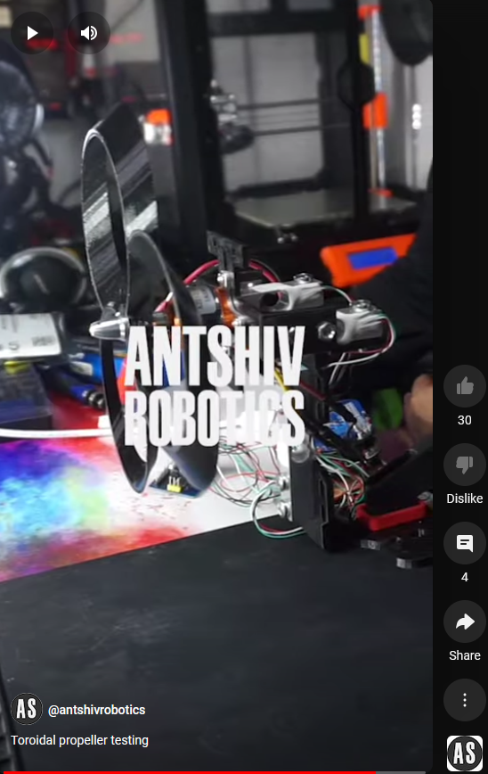
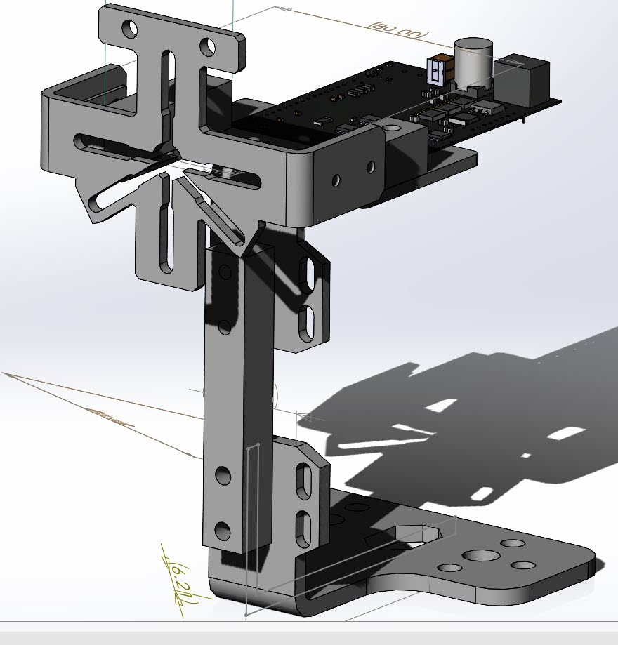
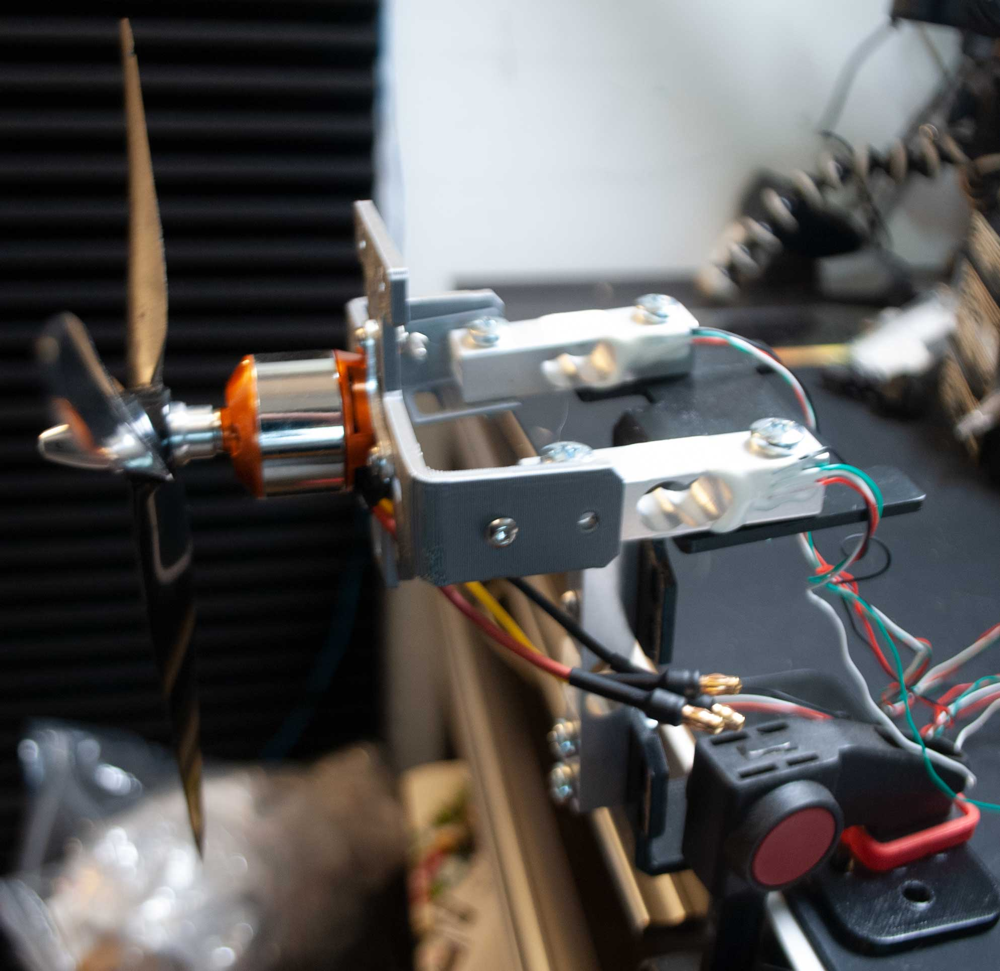
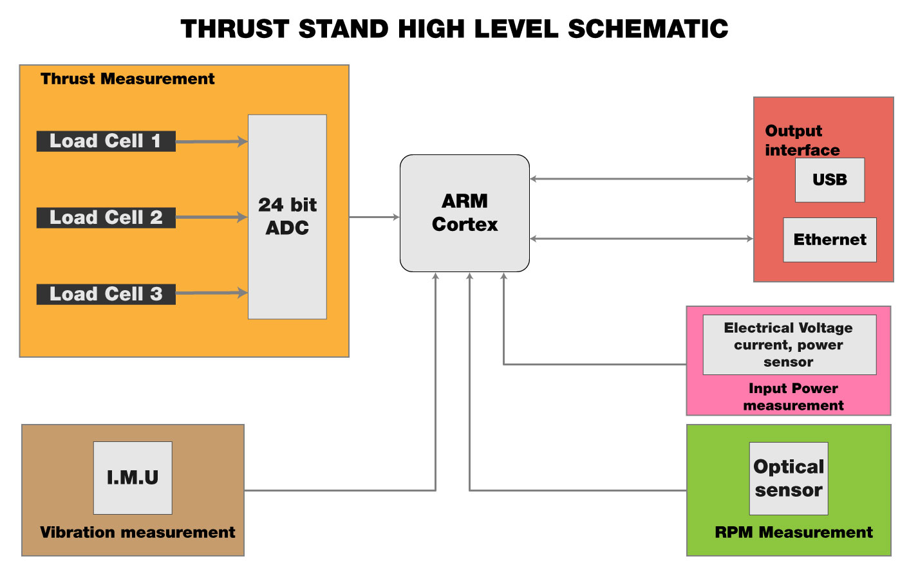
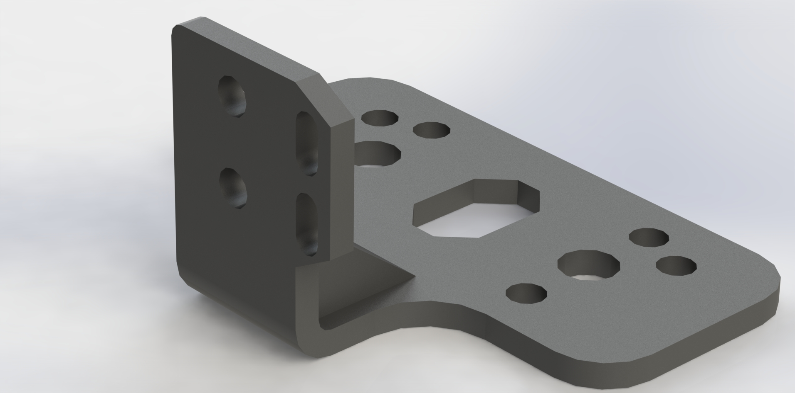
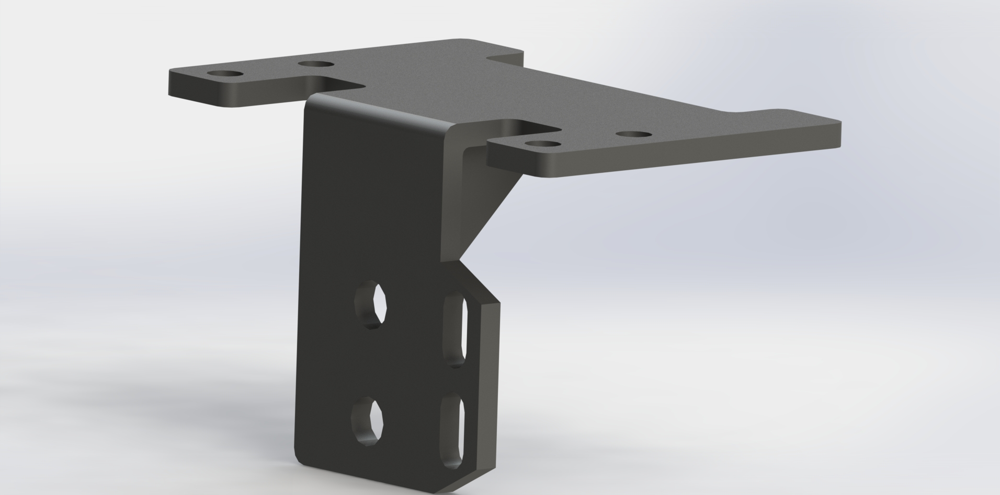
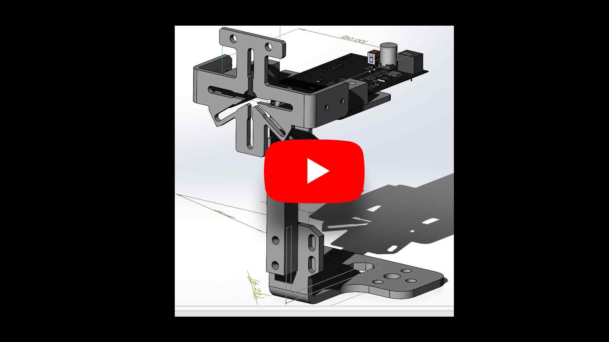

# ThrustStand
This repository will have all the information to create your own thrust stand.

You can see the demonstration of this thruststand using a different type of propeller

## Getting Started

### Prerequisites
To build the thrust stand you will need the following:
* Git
* General knowledge of electronics
* General knowledge of mechanics
* 3d printer
* CNC machine (optional)
* Solidworks (optional)
* Altium Designer (optional)
* Emscripten (optional)

## Hardware 

This folder will contain both the mechanical and eletronics files required to build 
the thrust stand. 
The 3d model parts are modelled using Solidworks.
The electronics will be designed using Altium Designer. 

## Software
This folder will contain the software required to run the thrust stand.
The embedded software will be written in C/C++ and will be compiled using the GNU C/C++ compiler.
The GUI will be written in WebAssembly and will be compiled using Emscripten. 

## Documentation
This folder will contain all the documentation required to build the thrust stand.

## Images
This folder will contain all the images used in the documentation.
 - assets/images

## 3D Models Rendered Images 

## Contributing

Please read [CONTRIBUTING.md](CONTRIBUTING.md) for details on our code of conduct, and the process for submitting pull requests to us.

## Community
Please join our discord server to ask questions, share your projects, and help others. 

## License
This project is licensed under the MIT License - see the [LICENSE.md](LICENSE.md) file for details

## Acknowledgments
* Hat tip to anyone whose code was used
* Inspiration
* etc
